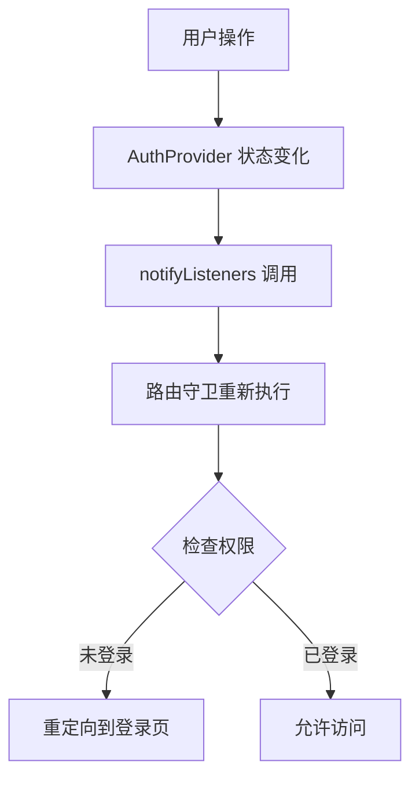

# TAMA2 应用路由系统说明文档

## 📋 目录
- [概述](#概述)
- [路由架构](#路由架构)
- [路由守卫机制](#路由守卫机制)
- [路由配置详解](#路由配置详解)
- [状态管理与路由联动](#状态管理与路由联动)
- [使用示例](#使用示例)
- [最佳实践](#最佳实践)

## 🎯 概述

TAMA2 应用使用 **GoRouter** 作为路由管理解决方案，配合 **Provider** 状态管理，实现了完整的路由守卫和权限控制系统。

### 核心特性
- ✅ **声明式路由配置**：清晰的路由结构定义
- ✅ **智能路由守卫**：基于用户状态的自动重定向
- ✅ **嵌套路由支持**：ShellRoute 实现主导航栏
- ✅ **状态感知路由**：与 AuthProvider 深度集成
- ✅ **类型安全导航**：GoRouter 提供的类型安全导航方法

## 🏗️ 路由架构

### 技术栈
- **路由库**：`go_router: ^13.2.0`
- **状态管理**：`provider: ^6.1.1`
- **导航组件**：`MainNavigation` (自定义主导航栏)

### 文件结构
```
lib/
├── app_router.dart          # 主路由配置文件
├── main.dart               # 应用入口，配置路由
└── shared/widgets/
    └── main_navigation.dart # 主导航栏组件
```

## 🛡️ 路由守卫机制

### 核心守卫逻辑

路由守卫位于 `AppRouter.router` 的 `redirect` 参数中：

```dart
redirect: (context, state) {
  final authProvider = context.read<AuthProvider>();
  final isLoggedIn = authProvider.isLoggedIn;
  final currentPath = state.uri.toString();
  final isAuthRoute = currentPath.startsWith('/auth');
  
  // 🚫 未登录用户重定向到登录页
  if (!isLoggedIn && !isAuthRoute) {
    return '/auth/login';
  }
  
  // 🏠 已登录用户在认证页面重定向到首页
  if (isLoggedIn && isAuthRoute) {
    return '/home';
  }
  
  return null; // 允许正常访问
},
```

### 守卫触发时机

1. **应用启动时**：检查初始路由权限
2. **路由切换时**：每次导航都进行权限验证
3. **状态变化时**：用户登录/登出状态改变时自动重定向

### 权限控制策略

| 用户状态 | 当前页面 | 重定向目标 | 说明 |
|---------|---------|-----------|------|
| 未登录 | 受保护页面 | `/auth/login` | 强制登录 |
| 已登录 | 登录/注册页 | `/home` | 避免重复登录 |
| 已登录 | 受保护页面 | 无重定向 | 正常访问 |
| 未登录 | 登录/注册页 | 无重定向 | 正常访问 |

## 🛣️ 路由配置详解

### 1. 认证路由 (Authentication Routes)

```dart
// 认证相关路由，无需登录即可访问
GoRoute(
  path: '/auth/login',
  builder: (context, state) => const LoginScreen(),
),
GoRoute(
  path: '/auth/register',
  builder: (context, state) => const RegisterScreen(),
),
```

**特点**：
- 路径以 `/auth` 开头
- 未登录用户可访问
- 已登录用户访问时自动重定向到首页

### 2. 主要功能路由 (Main Feature Routes)

```dart
ShellRoute(
  builder: (context, state, child) => MainNavigation(child: child),
  routes: [
    GoRoute(
      path: '/home',
      builder: (context, state) => const HomeScreen(),
    ),
    GoRoute(
      path: '/following',
      builder: (context, state) => const FollowingScreen(),
    ),
    GoRoute(
      path: '/message',
      builder: (context, state) => const MessageScreen(),
    ),
    GoRoute(
      path: '/profile',
      builder: (context, state) => const ProfileScreen(),
    ),
    // ... 其他功能页面
  ],
),
```

**特点**：
- 使用 `ShellRoute` 包装，共享主导航栏
- 所有页面都需要登录才能访问
- 自动显示底部导航栏

### 3. 主导航栏 (MainNavigation)

```dart
class MainNavigation extends StatelessWidget {
  final Widget child;
  
  @override
  Widget build(BuildContext context) {
    return Scaffold(
      body: child, // 路由页面内容
      bottomNavigationBar: BottomNavigationBar(
        // 底部导航栏配置
        items: [
          BottomNavigationBarItem(icon: Icon(Icons.home), label: '首页'),
          BottomNavigationBarItem(icon: Icon(Icons.favorite), label: '关注'),
          BottomNavigationBarItem(icon: Icon(Icons.message), label: '消息'),
          BottomNavigationBarItem(icon: Icon(Icons.person), label: '我的'),
        ],
      ),
    );
  }
}
```

## 🔄 状态管理与路由联动

### AuthProvider 集成

```dart
class AuthProvider extends ChangeNotifier {
  UserModel? _user;
  
  bool get isLoggedIn => _user != null;
  
  Future<void> logout() async {
    _user = null; // 清除用户状态
    notifyListeners(); // 通知路由守卫重新检查权限
    
    // 路由守卫会自动检测到 isLoggedIn = false
    // 并重定向到登录页
  }
}
```

### 状态变化流程



## 📱 使用示例

### 1. 页面导航

```dart
// 使用 GoRouter 进行导航
import 'package:go_router/go_router.dart';

// 导航到首页
context.go('/home');

// 导航到登录页
context.go('/auth/login');

// 导航到个人资料页
context.go('/profile');
```

### 2. 带参数的导航

```dart
// 导航到视频详情页（示例）
context.go('/video/${videoId}');

// 导航到用户空间页（示例）
context.go('/user/${userId}');
```

### 3. 条件导航

```dart
// 根据用户状态决定导航目标
if (authProvider.isLoggedIn) {
  context.go('/home');
} else {
  context.go('/auth/login');
}
```

## 🎨 最佳实践

### 1. 路由命名规范

- **认证路由**：使用 `/auth/` 前缀
- **功能路由**：使用描述性名称，如 `/home`、`/profile`
- **参数路由**：使用 `/path/:param` 格式

### 2. 权限控制

- 在路由守卫中统一处理权限逻辑
- 避免在页面内部重复权限检查
- 使用 `context.read<AuthProvider>()` 获取状态

### 3. 错误处理

```dart
// 路由守卫中的错误处理
redirect: (context, state) {
  try {
    final authProvider = context.read<AuthProvider>();
    // ... 权限检查逻辑
  } catch (e) {
    // 发生错误时重定向到登录页
    return '/auth/login';
  }
},
```

### 4. 性能优化

- 路由守卫逻辑保持简洁
- 避免在守卫中进行复杂的异步操作
- 使用 `context.read` 而不是 `context.watch` 来避免不必要的重建

## 🔧 扩展指南

### 添加新路由

1. **在 `app_router.dart` 中添加路由定义**
2. **更新 `MainNavigation` 的导航逻辑（如需要）**
3. **确保路由守卫正确处理新路由的权限**

### 自定义路由守卫

```dart
// 可以添加更复杂的权限逻辑
redirect: (context, state) {
  final authProvider = context.read<AuthProvider>();
  final user = authProvider.user;
  
  // 检查用户角色权限
  if (user != null && user.role == 'admin') {
    // 管理员特殊权限
  }
  
  // 检查页面访问权限
  if (state.uri.path == '/admin' && user?.role != 'admin') {
    return '/auth/login';
  }
  
  return null;
},
```

## 📝 总结

TAMA2 的路由系统通过 GoRouter 和 Provider 的完美结合，实现了：

- **安全性**：未授权用户无法访问受保护页面
- **用户体验**：自动重定向，无需手动处理权限
- **可维护性**：集中式路由配置，易于管理和扩展
- **性能**：智能的路由守卫，避免不必要的页面重建

这套路由系统为应用提供了坚实的基础架构，支持未来的功能扩展和权限管理需求。
